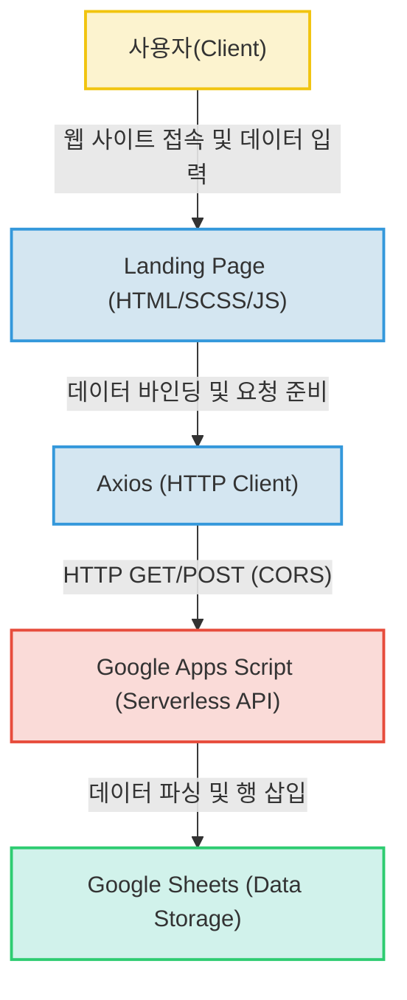

# 핏버디 커넥션 (Fit Buddy Connection) 랜딩 페이지

본 프로젝트는 운동 메이트 매칭 서비스인 **'핏버디 커넥션'**의 사전 마케팅 및 사용자 데이터 수집을 위해 구축된 랜딩 페이지입니다. 서버리스 아키텍처를 활용하여 효율적인 데이터 수집 파이프라인을 구축하고, 반응형 UI를 통해 사용자 경험을 최적화하는 데 집중했습니다.

## 📋 프로젝트 소개
- **서비스명**: 핏버디 커넥션 (Fit Buddy Connection)
- **목적**: 서비스 런칭 전 사용자 홍보, 캐릭터 성장/랭킹 시스템 소개 및 가망 고객 이메일 데이터 수집
- **주요 특징**: 고유 방문자 트래킹 및 외부 API 연동을 통한 실시간 데이터 관리

## ✨ 주요 기능
- **데이터 수집**: Axios와 Google Apps Script를 연동하여 사용자 이메일 및 방문 로그를 Google Sheets에 실시간 저장
- **사용자 트래킹**: UTM 파라미터 분석 및 쿠키를 활용한 고유 방문자(UV) 식별 및 유입 경로 추적
- **반응형 UI/UX**: Bootstrap 5와 SCSS를 활용하여 모바일 및 데스크톱 환경에 최적화된 화면 제공
- **인터랙티브 요소**: OwlCarousel 및 Counterup 라이브러리를 활용한 동적인 서비스 소개 섹션 구현

## 📂 프로젝트 구조
```text
project-root/
├── index.html           # 메인 랜딩 페이지
├── css/
│   └── style.css        # 컴파일된 메인 스타일시트
├── scss/                # 스타일 소스 파일 (모듈화 관리)
├── js/
│   └── main.js          # 비동기 통신 및 트래킹 로직
├── lib/                 # 외부 라이브러리 (OwlCarousel, Counterup 등)
└── img/                 # 서비스 이미지 자산
```

## 📄 핵심 파일 설명
1.  **`index.html`**: 서비스의 아이덴티티와 주요 기능(캐릭터 성장, 랭킹)을 설명하는 메인 랜딩 페이지입니다.
2.  **`js/main.js`**: 쿠키를 활용한 고유 방문자 식별, 유입 경로 트래킹, 그리고 Axios를 사용해 Google Apps Script API로 데이터를 전송하는 핵심 로직이 포함되어 있습니다.
3.  **`scss/` & `css/style.css`**: Bootstrap 5를 기반으로 커스텀 스타일링을 적용한 UI 정의 파일입니다.
4.  **`lib/`**: OwlCarousel, Counterup 등 인터랙티브한 UI 요소를 위한 외부 라이브러리들이 포함되어 있습니다.

## 🛠 기술 스택
### Frontend
- **HTML5/CSS3**: 웹 표준을 준수하여 구조적이고 직관적인 사용자 인터페이스를 구축했습니다.
- **Bootstrap 5.0.2**: 프레임워크의 그리드 시스템을 활용하여 다양한 디바이스에 대응하는 반응형 웹을 구현했습니다.
- **SCSS**: CSS의 모듈화와 변수 사용을 통해 스타일 코드의 재사용성과 유지보수성을 극대화했습니다.
- **jQuery**: DOM 조작 및 스크롤 애니메이션 등 인터랙티브한 사용자 경험을 간결한 코드로 구현했습니다.
- **Axios**: Promise 기반의 비동기 통신으로 사용자 입력 데이터를 백엔드로 안정적으로 전달했습니다.

### Backend & Storage
- **Google Apps Script (GAS)**: 별도의 서버 구축 없이도 서버리스 환경에서 데이터 처리 API를 신속하게 구현했습니다.
- **Google Sheets**: 구조화된 데이터 저장소로 활용하여 사용자 이메일 및 방문 로그를 실시간으로 관리했습니다.

### DevOps
- **Netlify**: 정적 호스팅 서비스를 통해 웹 애플리케이션을 신속하게 배포하고 지속적인 배포 환경을 구성했습니다.

## 🏗 시스템 아키텍처
본 프로젝트는 정적 웹 호스팅 환경에서 Google Apps Script(GAS)를 BaaS(Backend as a Service)로 활용하는 서버리스 아키텍처를 채택하고 있습니다.



## 🚀 실행 방법
추가 작성 필요

## 💡 기술 선택 이유
- **Google Apps Script**: 초기 운영 비용 없이 API 서버 역할을 수행할 수 있으며, Google Sheets와의 높은 호환성으로 인해 별도의 DB 구축 없이 데이터 수집이 가능합니다.
- **Netlify**: 정적 파일 호스팅에 최적화되어 있으며, GitHub 저장소와 연동하여 코드 수정 시 즉각적인 배포가 가능하여 생산성을 높였습니다.
- **SCSS**: 복잡한 스타일 코드를 계층 구조로 관리하고 변수(Variable)를 활용하여 일관된 디자인 시스템을 유지하기 위해 선택했습니다.
- **Axios**: 브라우저 호환성이 높고 JSON 데이터 처리가 간편하며, 비동기 처리를 통해 페이지 새로고침 없는 사용자 경험을 제공하기 위해 사용했습니다.

## 🔍 개선 방향 및 참고 사항
- **템플릿 의존성 정리**: 현재 `blog.html`, `class.html` 등 다수의 페이지가 존재하나, 이는 외부 템플릿(Gymster)의 기본 구성 요소이며 실제 서비스 활용 여부는 불분명합니다(추정). 향후 실제 서비스 페이지로의 교체 또는 제거가 필요합니다.
- **보안 강화**: 현재 API 호출 주소가 클라이언트 측 JavaScript(`main.js`)에 노출되어 있으므로, API 키 관리 또는 도메인 제한 설정 등의 보안 조치가 필요합니다(추정).
- **SEO 최적화**: 검색 엔진 최적화를 위한 메타 태그 보강 및 시맨틱 마크업 강화가 필요합니다.
- **분석 도구 확장**: 현재의 자체 쿠키 기반 트래킹 외에 Google Analytics(GA4) 등 전문 분석 도구와의 결합을 통해 더 정밀한 사용자 행동 분석이 가능할 것으로 보입니다.